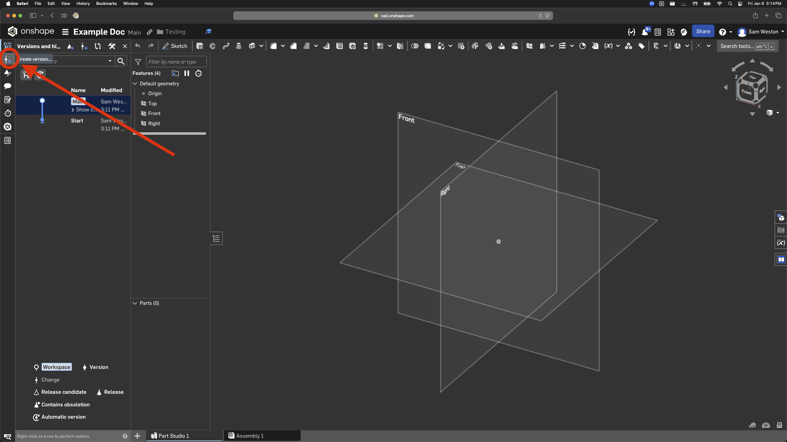

# Versioning Best Practices

The Onshape version tracking system for a document can be accessed through this tab on the left side of the page. 

A version is like a milestone in your design. Create a version if you reach a place you'd like to be able to get back to easily, for example if you are about to make drastic changes that may break geometry. A version must also be created in order to create a branch, which we will talk about next. To create a version, click this tab on the upper left of the page.

A branch is a separate design workspace that is maintained in parallel with the main branch. It allows you to try out designs or modify design aspects without effecting others who are working on other aspects of the same document. 

Merging one branch into another means copying any updates from the merging branch into the active branch. You can merge changes from the main branch to update the space you're working on with other people's changes, and when your changes are ready, you can merge them into the main branch to share your updates with everyone else. 

To create a new branch, right click the version you want to branch from in the versions and history tree, and select "Branch to create workspace...". 

To merge a branch, click the branch you want to merge into to open its workspace, then right click on the branch you want to merge into it, and select "merge into current branch".